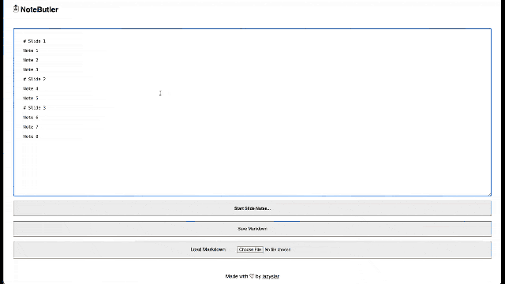

# NoteButler

`NoteButler` is a standalone HTML file that you can serve from any HTTP server or directly from your filesystem. It allows you to write your presentation notes in `Markdown` and then display them slide by slide, note by note, ensuring you never miss a beat.

You can add `# headlines` for slides and any number of `paragraphs` (other elements are ignored at the moment) for all the points you want to cover in each slide.

Use the `up` and `down` (or `left` and `right`) keys to navigate back and forth through your notes. Hit `esc` to return to editing mode.

Your notes are preserved in `localStorage`, and you can import and export notes from `.md` files.

## Mobile

In progress...

# Disclaimer

This is a 1-hour evening project, but I found it so useful that I will probably work a bit more on it.

~~Most of the code here was written with ChatGPT, though it's fairly simple in general~~ (by now I rewrote most of it).

# Todo

- [ ] React? Solid?
- [ ] Add Title (slug for export filename)
- [ ] Add Menu (slide in, part of burger menu)
- [ ] Improve styles
